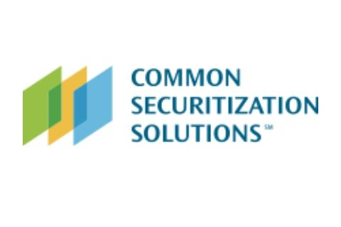

# **Common Securitization Solutions (CSS)**

## **Overview and Origin:**

  Common Securitization Solutions, LLC (CSS)  is a financial technology company that was created by Fannie Mae and Freddie Mac on October 7th, 2013 as a joint venture to build and operate the Common Securitization Platform (CSP) and develop a Unified Mortgage-backed Security (UMBS).  Under the direction and guidance of The US Federal Housing Finance Agency’s (FHFA), Common Securitization Solutions (CSS) was created as a joint venture between Fannie Mae and Freddie Mac to respond to FHFA’s 2014 Strategic Plan for the Conservatorships of Fannie Mae and Freddie Mac. The CSP plays a crucial role in securitizing U.S residential mortgages into mortgage-backed security which are sold to investors - providing the liquidity necessary to support new issuance of mortgages for new homeowners. 

CSS was created to help the U.S. housing finance system run as efficiently and transparently as possible by building the industry’s leading technology platform for issuing and managing mortgage security.  CSS supports Fannie Mae and Freddie Mac by bringing new standardized technology to their security issuance capabilities. CSS currently administers a portfolio of $5 trillions worth of mortgage-backed securities, representing 27 millions loans and supports issuance of over $200 billion in mortgage security each month. 

CSS is currently solely funded by Fannie Mae and Freddie Mac as these two enterprises are the only clients of CSS. By June 30, 2019, the total cost in the development and integration of CSP is projected to be $2.13 billion.

## **Business Activities:**

CSS’s purpose is unify the mortgage securitization process and issue a single Unified mortgage-backed security through the adoption of CSP. CSS will issue, manage, and administer billions in dollars of mortgage assets and large amounts of data will flow into the CSP and will publish transparent disclosures to investors and facilitate payments to their bonds. The CSP will also facilitate the many interactions that occur with counterparties through their standardized interfaces. CSP’s function was designed to be flexible and scalable. CSP is solely used by the enterprise and will most likely remain true for until it expands its services other financial market participants. In the future, CSS is also required by the FHFA to support the broader industry beyond Fannie Mae and Freddie Mac. Eventually, the CSP will be adapted to other provide participants in the secondary market. 

CSP is powered by cloud-based infrastructures and is intended to remain decentralized as the platform further expands their clientele an
Landscape 

CSS operates within the mortgage securitization and security issuance realm. It is currently the biggest fintech of its kind. Since there are no comparable competitors manages the packaging, processing and issuing of mortgage-backed security in the financial market. The CSP is the main innovation in the mortgage securitization landscape over the past few years. The trend is single class mortgage securities and the next focus might be multi-class fixed securities. 

## **Results**

On June 3, 2019, the new Uniform Mortgage-backed Security (UMBS) was launched on the CSP, representing a significant milestone for the company. The final milestone was preceded by multiple milestones in bringing additional liquidity and efficiency to the market. The successful integration of Fannie Mae and Freddie Mac’s processes was the result of the multi-year initiative. 

Some of the metrics in determining CSS’s success can be meeting its service-level commitment to the enterprises, meeting FHFA’s regulatory requirement and compliance. Unlike other privatized companies that are scrutinized against its revenue and financial commitments, CSS’s future success will be measured as strategic growth in servicing other financial market participants and improving the financial viability as an individually managed and operated company.  

## **Recommendations:**

As stated on CSS company’s website, they will continue to assess new opportunities to grow their business and serve additional participants in the U.S. housing market. It is also stated that their business was architected with the ability to serve other segments of the securitization market. Processing and issuing of liability-based securities (credit cards debt, student loan, car loans) on the secondary market might be a path for CSS to diversify their portfolio base and elevate CSS’s recoginiature  to a broader financial market as a major fintech firm. Additionally, CSS long-term strategy might include providing its CSP securitization service to the global mortgage market. 

Implementing Block-chain technology into the CSP will enhance the efficiency for validation and securitization, and transfer of payment for loans. As Block-chain technology matured and is more widely recognized and adopted, CSS will need to reimagine it’s business model and re-architect it’s CSP to remain the leader in its domain or risk losing it’s business to more innovative entrants. 

## **Resources:**

1. Home: CSS. (2020). Retrieved December 04, 2020, from https://www.commonsecuritization.com/
2. Get Started Here: Single Security Initiative/ CSP Timeline. (2019, June 3). Retrieved December 04, 2020, from https://www.fhfa.gov/PolicyProgramsResearch/Policy/Pages/Common-Securitization-Platform-and-Single-Security-Timeline.aspx
3. https://www.commonsecuritization.com/our-mission#who-is-css
4. Freddie Mac, Fannie Mae and Common Securitization Solutions Create Single Security/CSP Industry Advisory Group. (2015, July 8). Retrieved December 05, 2020, from https://freddiemac.gcs-web.com/news-releases/news-release-details/freddie-mac-fannie-mae-and-common-securitization-solutions
5. Special Report on the Common Securitization Platform: FHFA Lacked Transparency and Exercised Inadequate Oversight over a $2.13 Billion, Seven-Year Projecthttps://www.fhfaoig.gov/sites/default/files/OIG-2019-005%20Special%20Report%20on%20the%20Common%20Securitization%20Platform_Redacted.pdf. (2019, March 29). Retrieved December 04, 2020, from https://www.fhfaoig.gov/sites/default/files/OIG-2019-005%20Special%20Report%20on%20the%20Common%20Securitization%20Platform_Redacted.pdf
